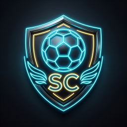

<div align="center">

  

  # 🏆 STRIKERS KING CREATOR
  ### Canlı Yayın Espor Turnuva, Kaptan Draftı & OBS Overlay Yönetim Sistemi

  <p align="center">
    <b>Kick / Twitch yayıncıları ve topluluk turnuvaları için geliştirilmiş yeni nesil interaktif takım kurma platformu.</b>
  </p>

  <div>
    <a href="https://mehmet7helvaci.github.io/TAKIM-SE-ME-UYGULAMASI-Strikers-King-Creator/">
      
    </a>
    <a href="https://github.com/mehmet7helvaci/TAKIM-SE-ME-UYGULAMASI-Strikers-King-Creator/actions/workflows/deploy-pages.yml">
      
    </a>
    
    
  </div>

  <br/>

  <p align="center">
    <a href="#-uygulamanın-amacı">🎯 Amaç</a> •
    <a href="#-neler-yapabilir-özellikler">⚡ Özellikler</a> •
    <a href="#-obs-studio-canlı-yayın-ayarları">📺 OBS Overlay</a> •
    <a href="#-merkezi-veri-havuzu-data-hub">🌐 Veri Havuzu</a> •
    <a href="#-teknoloji-yığını">🛠️ Teknolojiler</a> •
    <a href="#-hızlı-başlangıç-ve-indirme">🚀 İndir & Kur</a>
  </p>

</div>

---

## 🎯 Uygulamanın Amacı

**Strikers King Creator**, canlı yayıncıların (özellikle **Kick** ve **Twitch** yayıncılarının) izleyicileriyle birlikte turnuvalar, dostluk maçları ve espor etkinlikleri düzenlerken yaşadığı tüm karmaşayı ortadan kaldırmak için tasarlanmıştır.

Yayın esnasında oyuncu isimlerini not almakla, takımları dengelemekle veya yayın ekranına manuel skor yazmakla uğraşmak yerine; **chat komutları, yapay zeka destekli akıllı eşleme, canlı turnuva ağacı ve OBS canlı yayın HUD'u** ile tüm süreci tek bir merkezden profesyonelce yönetmenizi sağlar.

---

## ⚡ Neler Yapabilir? (Özellikler)

### 1. 💬 Canlı Chat Entegrasyonu & Akıllı Oyuncu Seçimi
* **Otomatik Oyuncu Havuzu:** İzleyiciler sohbete `!katil`, `!katıl` veya belirlenen komutları yazarak turnuva bekleme odasına katılır.
* **Akıllı Kaptan Draftı:** Kaptanlar yayında chate `!seç [oyuncu]`, `!al [oyuncu]`, `isec [isim]` yazdığında sistem yazım hatalarını tolere ederek oyuncuyu otomatik olarak kaptanın takımına transfer eder.
* **Sıfır Gecikmeli Avatar Çekimi:** Kick API üzerinden asenkron çalışan avatar motoru sayesinde yayıncının sunucusunda veya arayüzünde tek bir milisaniye dahi donma yaşanmaz.
* **Tek Tıkla Hızlı Atama:** Sürükle-bırak yapmaya gerek kalmadan oyuncu kartlarındaki **[➡️ Takıma Gönder]** butonuyla anında kadro oluşturma.

### 2. 🏆 Dinamik Turnuva Ağacı & Büyük Final (Bracket)
* **Otomatik Eşleşmeler:** 4'lü, 8'li veya 16'lı turnuva ağaçları oluşturma.
* **Büyük Final Dengelemesi:** Çeyrek Final ve Yarı Finallerden Şampiyonluk Podyumuna kadar mükemmel dikey hizada espor bracket görünümü.
* **Tek Tuşla Tur Atlama:** Kazanan takım seçildiğinde otomatik olarak bir üst tura taşınır ve şampiyonluk konfetileri patlar.

### 3. 📺 OBS Studio Canlı Yayın Overlay (Espor HUD)
* **Saydam & Şık Arayüz:** OBS Browser Source (Tarayıcı Kaynağı) için özel olarak tasarlanmış transparan neon siberpunk espor tasarımı.
* **Sıfır Gecikmeli Senkronizasyon:** Yönetim panelinde yapılan her değişiklik (skor, kadro, tur) anında OBS ekranına yansır.
* **Auto-Fit & Ölçekleme:** Ekrana tam sığdırma (`✨ Otomatik Düzelt`), `%60`'tan `%120`'ye hazır zum ayarları ve temiz espor podyumu.
* **Klavye Kısayolları:** Tek tuşla odak sıfırlama (`Esc`), OBS moduna geçiş (`O`), hızlı kura çekimi.

### 4. 🌐 Çoklu Yayıncı Senkronizasyonu & Merkezi Veri Havuzu (Data Hub)
* **Tek Turnuva, Çoklu Yayın:** Birden fazla yayıncı aynı etkinliği sunarken hepsi tek bir sunucuya bağlanabilir.
* **Cloudflare Quick Tunnel:** Modemden port açmaya gerek kalmadan, IP adresini gizleyerek güvenli `trycloudflare.com` bağlantısı üzerinden anında küresel ortak sunucu.
* **Canlı Çift Yönlü İstatistik:** Bir yayıncı maç sonucunu onayladığında diğer tüm yayıncıların ekranında ve OBS'inde anlık bildirim (`📢 A Yayıncısı: X Oyuncusu 2 Gol attı!`) patlar.

### 5. 📊 İstatistik & Liderlik Tablosu
* Maç başına ve kümülatif Gol, Asist, Kurtarış, Galibiyet ve Mağlubiyet istatistikleri.
* Oyuncuların genel kariyer performanslarını gösteren MVP sıralama tablosu.

---

## 📺 OBS Studio Canlı Yayın Ayarları

1. OBS Studio'yu açın.
2. **Kaynaklar (Sources)** bölümünden **`+`** butonuna basıp **Tarayıcı (Browser)** seçeneğini ekleyin.
3. Açılan pencerede:
   * **URL:** `http://localhost:8080/app/?obs=1` *(veya GitHub Pages linkinin sonuna `?obs=1` ekleyin)*
   * **Genişlik (Width):** `1920`
   * **Yükseklik (Height):** `1080`
   * **Özel Tarayıcı:** "Sayfa görünür olduğunda yenile" seçeneğini işaretleyin.
4. Tamam'a tıkladığınızda şeffaf ve profesyonel turnuva arayüzü yayınınızda görünecektir!

---

## 🌐 Merkezi Veri Havuzu (Data Hub)

Birden çok yayıncı ortak turnuva düzenleyeceğinde:

1. **Ana Sunucu (Host):** Uygulama menüsünden **`🌐 Veri Merkezi`** butonuna tıklayın ve **"Tüneli Başlat"** deyin.
2. Size özel üretilen güvenli tünel linkini (`https://*.trycloudflare.com`) kopyalayın.
3. **Diğer Yayıncılar (Client):** Aynı menüden linki yapıştırıp **"Bağlan"** butonuna basarak aynı veri tabanına dahil olsun.
4. Tüm goller, asistler ve maç sonuçları anında her iki yayında da kümülatif olarak güncellenir!

---

## 🛠️ Teknoloji Yığını

| Alan | Kullanılan Teknolojiler |
| :--- | :--- |
| **Ön Yüz (Frontend)** | HTML5, CSS3 (Modern Neon Glassmorphism, CSS Grid & Flexbox), Vanilla JavaScript (ES6+) |
| **Gerçek Zamanlı İletişim** | BroadcastChannel API, LocalStorage Sync, Fetch REST API |
| **Masaüstü & Sunucu** | C# (.NET Framework / Core), Asenkron PowerShell HTTP Daemon Engine |
| **Ağ & Tünel** | Cloudflare Quick Tunnel (`cloudflared`), REST API Server |
| **Sürekli Dağıtım (CI/CD)** | GitHub Actions & GitHub Pages |

---

## ⌨️ Klavye Kısayolları

| Kısayol | İşlev |
| :---: | :--- |
| `Esc` | Ekran odağını sıfırlar ve tüm turnuva ağacını merkeze alır |
| `O` | Yönetici paneli ile OBS Overlay modu arasında geçiş yapar |
| `F` | Tam Ekran (Fullscreen) modunu açar / kapatır |

---

## 👤 Geliştirici

**MeH4n**
* Proje: *Strikers King Creator - Espor Turnuva & Takım Seçme Uygulaması*
* GitHub: [@mehmet7helvaci](https://github.com/mehmet7helvaci)

---

## 🚀 Hızlı Başlangıç ve İndirme

Uygulamayı 2 farklı şekilde kullanabilirsiniz:

### Seçenek A: Doğrudan Web'den (Kurulumsuz)
Herhangi bir dosya indirmeden doğrudan tarayıcınızdan açıp kullanabilirsiniz:

👉 **[Canlı Yayını Başlat (Web Sürümü)](https://mehmet7helvaci.github.io/TAKIM-SE-ME-UYGULAMASI-Strikers-King-Creator/)**

### Seçenek B: Yerel Masaüstü Sürümü (Windows)
Chat entegrasyonu ve yerel sunucu avantajlarından tam yararlanmak için:
1. Bu projeyi bilgisayarınıza indirin (ZIP veya Git ile):
   ```bash
   git clone https://github.com/mehmet7helvaci/TAKIM-SE-ME-UYGULAMASI-Strikers-King-Creator.git
   ```
2. Klasör içerisindeki **`StrickersKingCreator.exe`** veya **`app/Baslat.bat`** dosyasına çift tıklayın.
3. Uygulama otomatik olarak yerel sunucuyu (`http://localhost:8080`) başlatır ve tarayıcınızda açar.

---

<div align="center">
  <sub>Tüm hakları saklıdır. Canlı yayınlarınızı daha profesyonel ve keyifli kılmak için tutkuyla geliştirildi. ⚽👑</sub>
</div>
